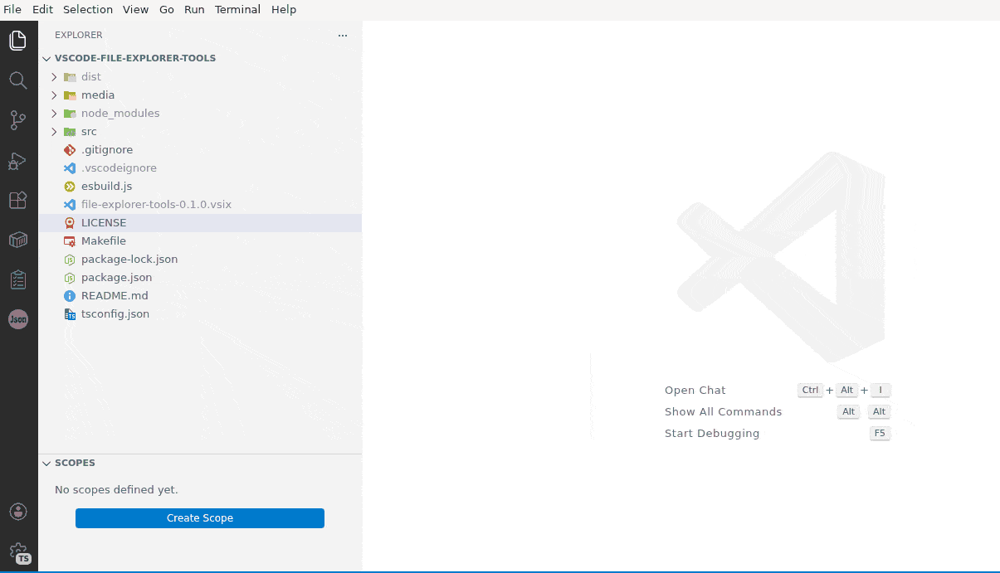

# File Explorer Tools

> File scope management, recursive folder expand, and automatic symbol rename on file rename — power tools for the VS Code Explorer

## Why I Built This

I work on a large monorepo with hundreds of folders and thousands of files. Every day I'd find myself collapsing and expanding the same subtrees, losing track of which files belong to the feature I'm working on, and manually renaming classes after renaming files. Small frictions, but they add up to real time lost.

VS Code's built-in Explorer is surprisingly barebones for a tool developers live in all day. There's no way to bookmark a subset of files, no recursive expand button, and renaming a file doesn't touch the symbols inside it. I looked at what's out there — extensions like **File Nesting Updater** or **Explorer Exclude** solve narrow problems but don't address the broader workflow. **Peacock** colors your workspace, not your files. Nothing gave me a way to say "these 12 files are my current scope" and just hide everything else.

So I built File Explorer Tools — a small, focused set of power-ups for the Explorer panel that I actually needed every day:

- **Scope filtering** so I can zoom in on just the files that matter for a given task, without setting up a multi-root workspace or touching `.gitignore`
- **Recursive expand** because clicking 30 folders one by one is not a workflow
- **Rename cascade** because if I rename `user-service.ts` to `account-service.ts`, the class inside should follow — and so should every import across the project

## Why File Explorer Tools?

- **Universal Compatibility**: Works with **VSCodium**, **Cursor**, **Windsurf**, and other VS Code forks. Published to the **[Open VSX Registry](https://open-vsx.org/extension/AncientSouls/file-explorer-tools)** for the broadest reach.
- **Native Integration**: No custom tree views or side panels. Scopes filter the actual built-in File Explorer via `files.exclude`, so everything — search, quick open, git — stays consistent.
- **Zero Config**: Install and go. No JSON files to create, no settings to tweak. Right-click a file, add it to a scope, done.
- **Lightweight**: No background processes, no file watchers polling your disk, no telemetry. Just three focused features that do their job and get out of the way.
- **Version Control Friendly**: Shared scopes live in `.vscode/scopes.json` so your team can commit and share them. Personal scopes stay local.

---

## Scopes Manager

Assign files and folders to named scopes directly from the Explorer context menu. When a scope is selected, the native File Explorer filters down to show only the files that belong to it — powered by `files.exclude` under the hood.

- Add files or entire folders to a scope via right-click or keyboard shortcut
- Click a scope in the Explorer sidebar to **filter the File Explorer** to just that scope's files
- Click again or press the deselect button to restore the full file tree

#### Commands

| Name                                   | Description                                |
| -------------------------------------- | ------------------------------------------ |
| `Scopes Manager: Create Scope`         | Create a new named scope                   |
| `Scopes Manager: Add to Scope`         | Add selected files/folders to a scope      |
| `Scopes Manager: Remove from Scope`    | Remove selected files/folders from a scope |
| `Scopes Manager: Delete Scope`         | Delete an existing scope                   |
| `Scopes Manager: Rename Scope`         | Rename an existing scope                   |
| `Scopes Manager: Clear Scope Patterns` | Remove all patterns from a scope           |
| `Scopes Manager: Install scopes MCP`  | Configure MCP server in the workspace      |

#### Keybindings

Keybindings are active when the File Explorer or an Editor is focused.

| Name                                | Description                           | Keybinding |
| ----------------------------------- | ------------------------------------- | ---------- |
| `Scopes Manager: Add to Scope`      | Add selected files/folders to a scope | `Alt+S`    |
| `Scopes Manager: Remove from Scope` | Remove selected files from a scope    | `Alt+D`    |

#### Context Menus

- **Explorer context menu** &mdash; _Add to Scope_, _Remove from Scope_
- **Scopes list context menu** &mdash; _Delete_, _Rename_, _Clear Patterns_

#### Settings

| Name                        | Description                                                                           | Default |
| --------------------------- | ------------------------------------------------------------------------------------- | ------- |
| `scopesManager.localScopes` | Locally stored scopes (not committed to VCS). Managed automatically by the extension. | `[]`    |

> Shared scopes are stored in `.vscode/scopes.json` and can be committed to version control.

#### How It Works

Scope filtering uses the native VS Code `files.exclude` workspace setting. When you select a scope, the extension computes which files and folders are _not_ part of the scope and temporarily adds them to `files.exclude`. Deselecting the scope restores the original exclude list. This means filtering works with the built-in File Explorer &mdash; no custom tree views needed.

> **Tip: Searching while a scope is active**
> Because scopes use `files.exclude`, VS Code search and Quick Open (`Ctrl+P`) will also be filtered. To search everywhere without deactivating your scope, toggle the **"Use Exclude Settings and Ignore Files"** (gear icon) in the Search view.

#### MCP Integration

The extension includes a [Model Context Protocol (MCP)](https://modelcontextprotocol.io/) server that allows LLMs to interact with your defined scopes.

- **Tools**:
  - `list_scopes`: List all available scope names in the current workspace.
  - `get_scope_patterns`: Get the glob patterns for a specific scope.

To install the MCP server automatically, run the **`Scopes Manager: Install scopes MCP`** command from the Command Palette (`Ctrl+Shift+P`). This will create or update a `.mcp.json` or `.gemini/settings.json` file in your workspace root.

For manual configuration (e.g., in Claude Desktop), use:
- **Command**: `node`
- **Arguments**: `path/to/extension/tools/mcp-scopes/server.js`
- **CWD**: Your project root directory

---

## Expand Recursively

One-click recursive expansion of all folders in the File Explorer. Appears as an icon in the Explorer title bar.

- Expand entire workspace or a specific folder from the context menu
- Configurable exclude list (skip `node_modules`, `dist`, `.git`, etc.)
- Progress notification with cancel support

#### Commands

| Name                                | Description                                         |
| ----------------------------------- | --------------------------------------------------- |
| `File Explorer: Expand Recursively` | Recursively expand all folders in the File Explorer |

#### Context Menus

- **Explorer context menu** &mdash; _Expand Recursively_ (folders only)
- **Explorer title bar** &mdash; expand-all icon button

#### Settings

| Name                                             | Description                                                      | Default                                                                                                                                            |
| ------------------------------------------------ | ---------------------------------------------------------------- | -------------------------------------------------------------------------------------------------------------------------------------------------- |
| `fileExplorer.expandRecursively.excludePatterns` | Folder names or glob patterns to skip during recursive expansion | `.git`, `.svn`, `.vs`, `.vscode`, `.cache`, `__pycache__`, `node_modules`, `dist`, `packages`, `build`, `target`, `Release`, `Debug`, `bin`, `obj` |

#### How It Works

Walks the directory tree using the VS Code filesystem API, expanding each folder via `revealInExplorer` and `list.expand`. Folders matching the exclude patterns are skipped automatically.

## Rename Cascade

When you rename a file in the Explorer, the matching class or export inside it is automatically renamed too (using the language server's rename provider), cascading the change across the entire project.

- Converts file base names to PascalCase to find the matching symbol (e.g., `foo-entity` &rarr; `FooEntity`)
- Handles compound extensions: `foo-bar.component.ts` &rarr; `FooBarComponent`
- Supports `.ts`, `.tsx`, `.js`, `.jsx`, `.java`, `.kt`, `.cs`, `.py`, `.go`
- Three modes: auto-rename, prompt for confirmation (default), or disabled

#### Examples

| File rename                                    | Symbol rename                          |
| ---------------------------------------------- | -------------------------------------- |
| `foo-entity.ts` &rarr; `bar-entity.ts`         | `FooEntity` &rarr; `BarEntity`         |
| `bar-entity.ts` &rarr; `bar-entity.component.ts` | `BarEntity` &rarr; `BarEntityComponent` |
| `FooService.java` &rarr; `BarService.java`     | `FooService` &rarr; `BarService`       |

#### Settings

| Name                              | Description                                                               | Default    |
| --------------------------------- | ------------------------------------------------------------------------- | ---------- |
| `fileExplorer.renameCascade.mode` | `"always"` auto-rename, `"prompt"` ask first, `"never"` disable entirely | `"prompt"` |

#### How It Works

Listens for `onDidRenameFiles` events, strips the language extension, derives the old and new PascalCase symbol names from the remaining file name (including compound parts like `.component`, `.module`), finds the old symbol in the file content, and invokes `vscode.executeDocumentRenameProvider` to rename it project-wide.

